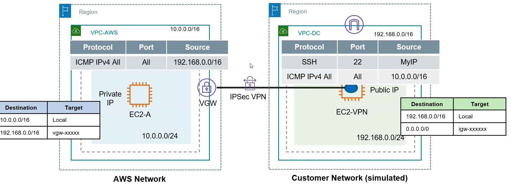

# Part 1: Setup Site-To-Site VPN between AWS VPC and simulated on-premise network

## Architecture

## Steps
1. Create VPCs in two different regions. One acts as an AWS network and other as an on-premises DC network.
2. Launch EC2 instances in both the VPCs. For the intstance in VPC-DC, launch it using the ***Amazon Linux 2023 AMI*** so that you can install a software called "Librewswan". In the security groups for both instaces allow ICMP traffic from the other network. EC2-VPN will have a public IP. You should also opne SSH from MyIP or 0.0.0.0/0.
3. Create a virtual private gateway and associate it with VPC-AWS. Add a route in VPC-AWS's private subnet route table to route all the traffic (0.0.0.0./0) via the virtual private gateway. Create a customer gateway using the EC2-VPN public IP.
4. Create a VPN connection. Use EC2-VPN public IP with static routing using the CIDR of VPC-DC.
5. Download the VPN configuration file for Openswan from the VPN connection console.
6. Install Libreswan on EC2-VPN. After installing Libreswan, follow the instructions in the VPN configuration file. You need to replace values for fields like IP and CIDR according to your environment, start the IPSec VPN service.
7. Access the AWS side EC2-A instance Private IP from EC2-VPN. You should be able to access it.