# Part 1: Hosting A Static Website on Amazon S3 With A Custom Domain Name

**prerequisite:**
* Create your own public domain name via a domain name provider (ex: GoDaddy.com)
* Create a Route53 Public Hosted Zone for same domain and update Route53 nameservers into your domain registrar DNS settings.

## Steps
1. Create an S3 bucket for your website (make sure that the bucket is public by unchecking the "Block all public access" box during setup). 

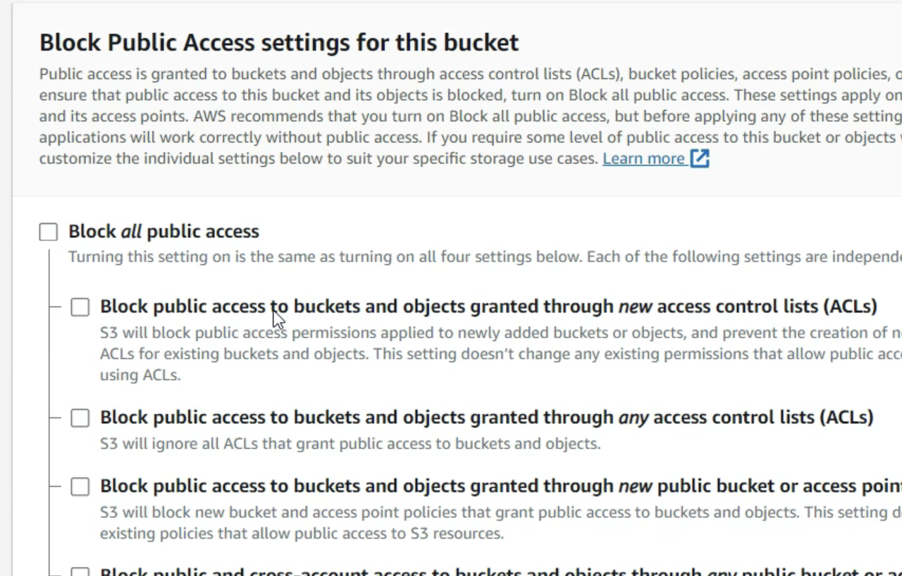
2. Upload static website content to your bucket
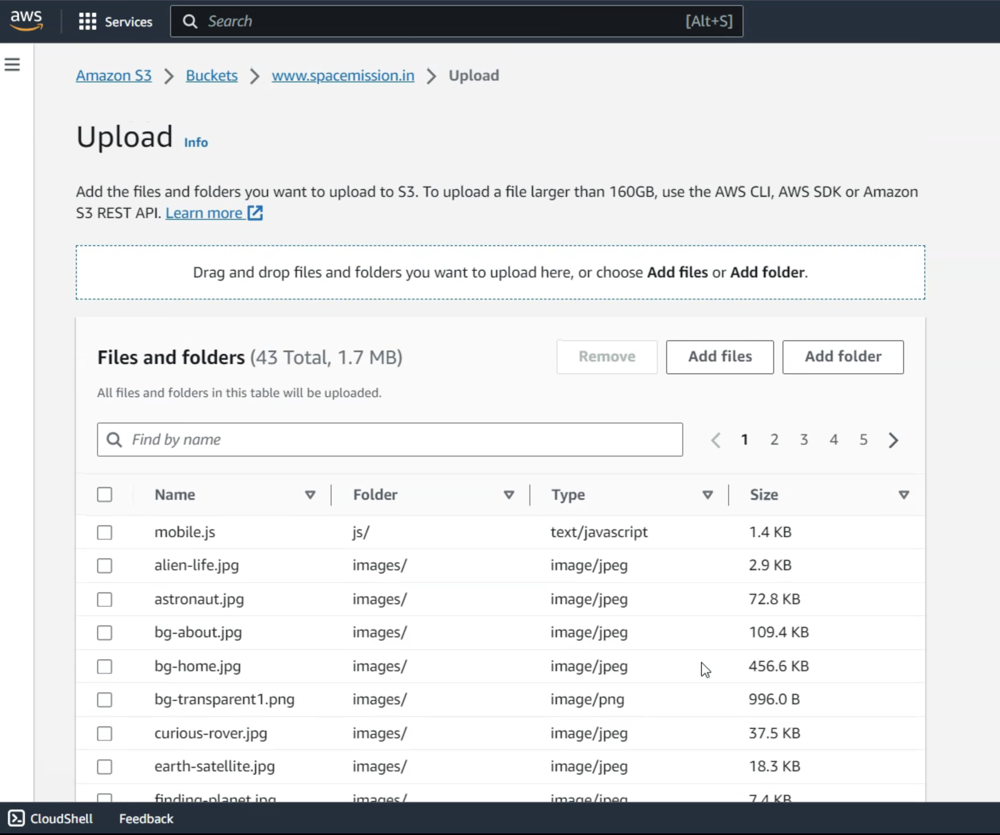
3. Enable your S3 bucket for website hosting with an index document (index.html)
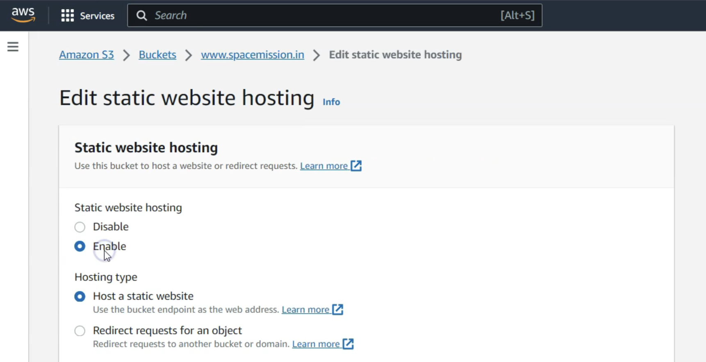

4. Modify bucket permissions to allow public access. Unblock "Block all public access" settings and add bucket policy.
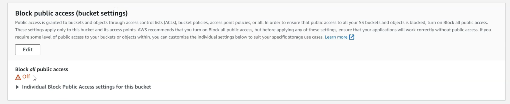

5. Access the bucket using the bucket website endpoint
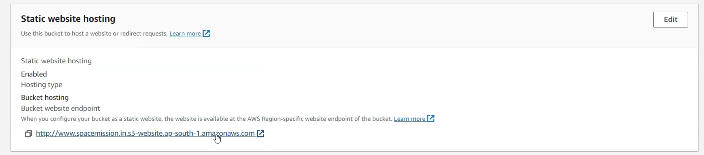

6. In your Route53 public hosted zone, create an alias record for your domain name pointing to the S3 bucket endpoint (this way you don't have to use the endpoint name but can use your domain name instead which is usually shorter/easier to remember)

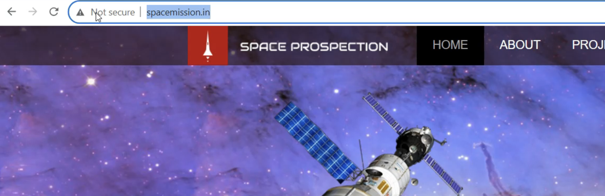

# Part 2: Securing Your S3 Static Website with HTTPS and CloudFront

## Steps
1. Create a TLS certificate for your domain name by using Amazon Certificate Manager (it must be created in the N. Virginia region!)
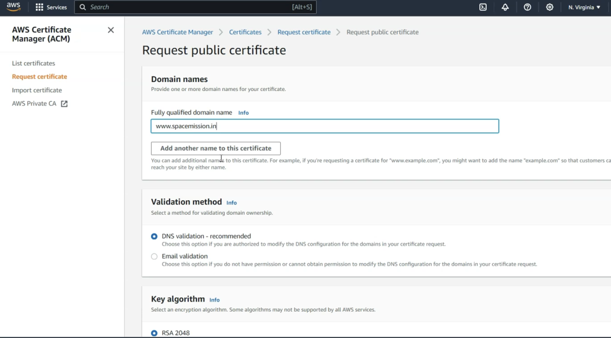
- click on your certificate ID, and in the Domains section select "Create records in Route 53"
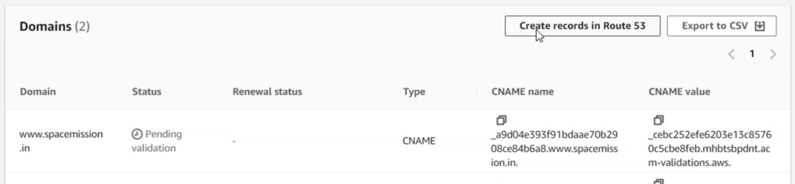
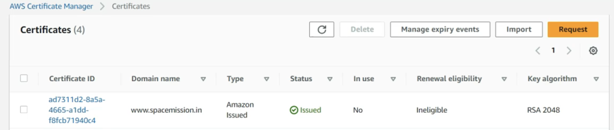
2. Create a CloudFront distribution with the website endpoint as the origin. Confiugre the viewer protocol policy to redirect HTTP to HTTPS

- During the setup ensure you set viewer protocol policy to "Redirect HTTP to HTTPS" (this ensures no one can access the website over HTTP only HTTPS, making it more secure)
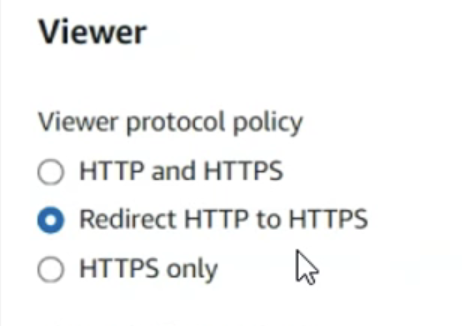
- Additionally in the setup ensure the Custom SSL certificate is set to use the one you generated via Amazon Certificate Manager
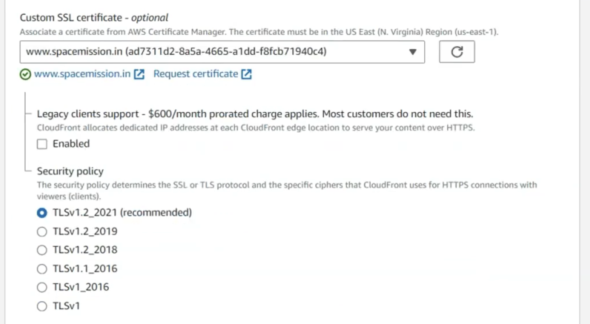
- the rest of the cloudfront settings can be left as default
3. Update your Route53 record to point to the CloudFront distribution
- Select your record, and in the edit record box, under "Route traffic to" select Alias to CloudFront distribution, and choose your distribution from the dropdown

4. Try accessing your website via the domain name, it should now be secured via https (ex: https://www.domainname.com)
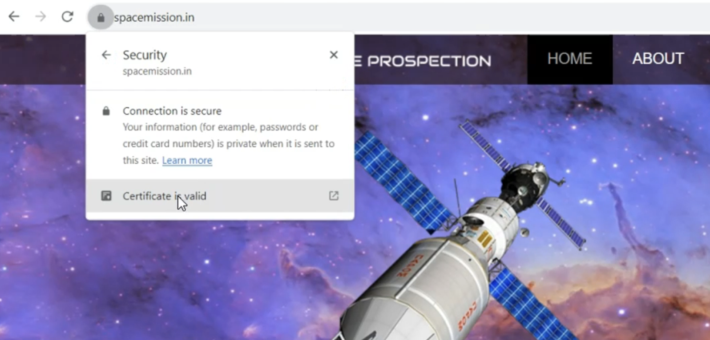
