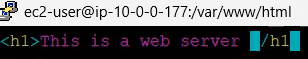
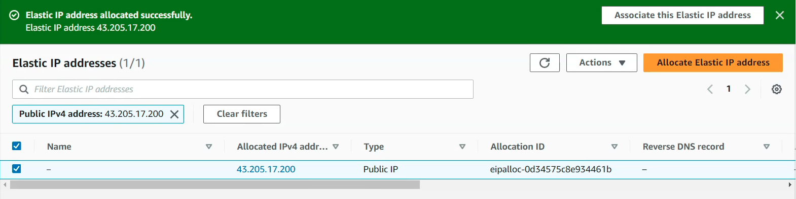
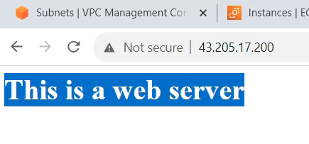
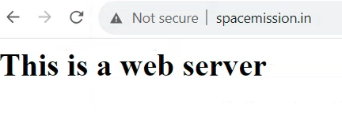

# Route53 DNS Region Level Failover

**Prerequisites:**
* Replicate the same AWS environment in two different regions (similar VPC, subnet, IGW and ec2 instance)
* Create a public doamin name (ex: via GoDaddy.com)
* Ensure that your DNS is pointing to it as an AWS ROUTE53 public hosted zone.
## Steps
1. Launch an ec2 instance and assign a public IP to it. Allow SSH and HTTP in its security group.
2. Install a httpd web server on the instance

3. Create an elastic IP and assign it to the EC2 instance

4. Validate that you can access the web page over the internet using the EC2's elastic IP

5. Now you should be able to access the webserver using your custom domain name.

6. In Route53 create a health check for the instance 

7. In your Route53 public hosted zone (ex: in the screenshot below i'm using the "spacemission.in" hosted zone), Create a record (Type: A record) that points to the EC2's public IP. In the routing policy select "Failover" and as the "Failover record type" select Primary or Secondary (for your second ec2 instance in your other region, you should select the opposite of what you initially choose here).

8. Repeat steps 1-7 for the second instance.
