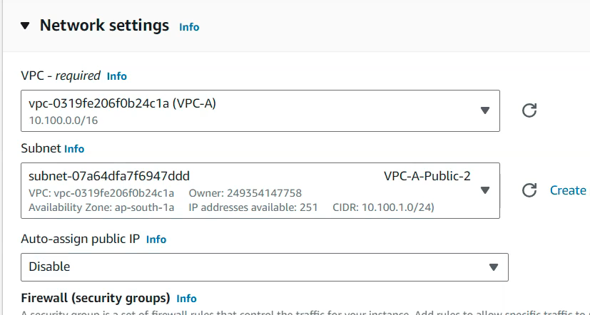
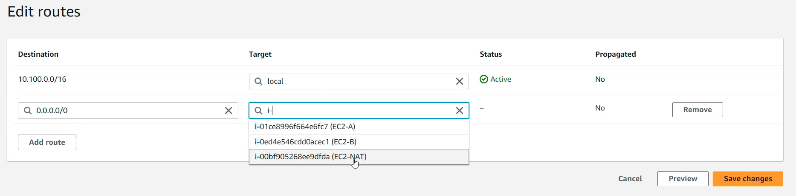

# Routing Traffic With EC2 NAT Instance Instead of Using A Nat Gateway 

**Overview:** Let's say you want to host your application privately, but want to avoid the cost of using a NAT gateway to route traffic to/from the instance. Alternatively, you have the option to use an EC2 instance to serve this purpose.

## Steps
1. Go to the EC2 serial console and select launch instance
1. When configuring the AMI, search for NAT AMI's and select one.

3. Ensure that the instance gets launched in a public subnet and gets a public IP assigned (ideally you should create an elastic ip and attach it to this instance). 

4. Assign security groups - For inbound traffic, it should receive HTTP & HTTPS and be available to resources inside its current VPC (define source as the VPC CIDR).

5. After creating your ec2 instance disable the source/destination check for it.

6. Update the route table of your private subnet that hosts your application, and allow all outbound traffic to your NAT instance

7. Now if you try to ping a website on the application server it will now get routed through the NAT instance.
