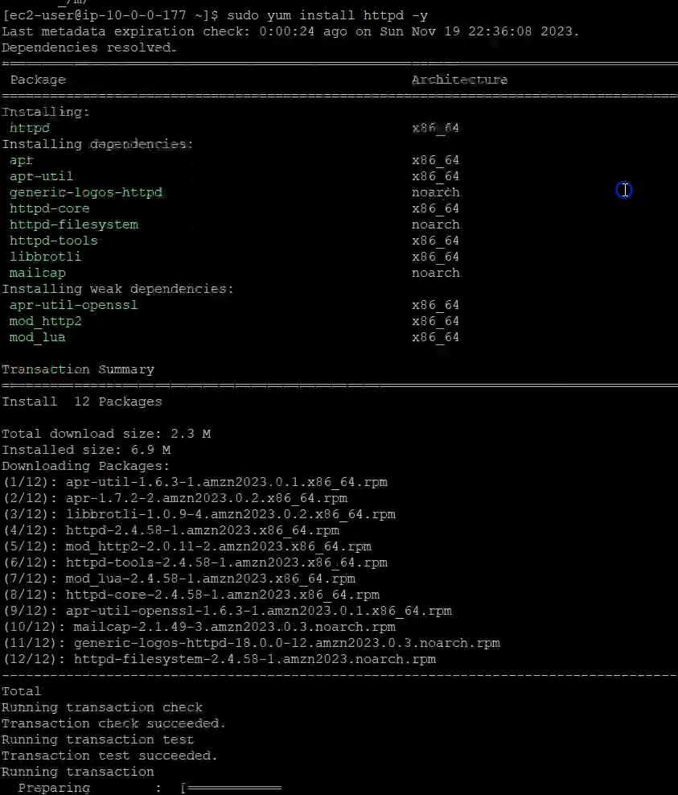

# Route53 DNS Region Level Failover

## Steps
1. Launch an ec2 instance and assign a public IP to it. Allow SSH and HTTP in its security group.
2. Install a httpd web server on the instance

3. Create an elastic IP and assign it to the EC2 instance

4. Validate that you can access the web page over the internet using the EC2's elastic IP
