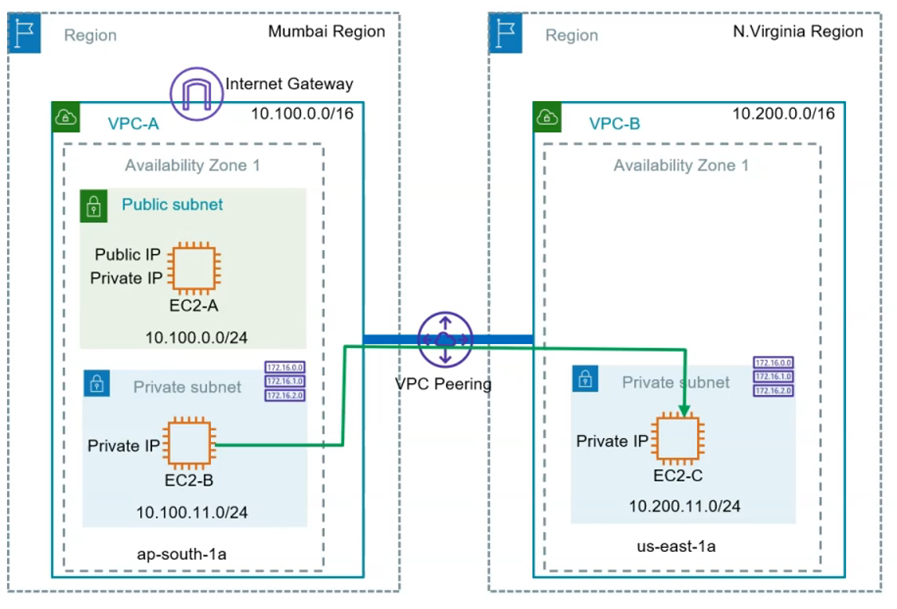
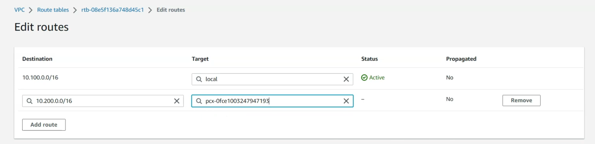

# Part 1: Create VPC Peering between VPCs across AWS regions and connect to EC2 instance over private IP by using A VPC peering connection

## Architecture 

## Steps
1. Create 2 VPCs in different AWS regions, create an internet gateway and associate it with VPC-A, VPC-B does not need an internet gateway.
2. Create public and private subnets in the respective VPCs (VPC-A & VPC-B)
3. Launch EC2 instances in respective subnets. Only the EC2 instance in the public subnet of VPC-A should have a public IP. Create security groups to allow SSH from EC2-A to EC2-B and test the connection by using SSH and ping from EC2-B to EC2-C

4. Login to EC2-A and connect via SSH to EC2-B. Try to ping EC2-C, you should not be able to reach EC2-C via EC2-B.

5. Create VPC peering between both the VPCs

    - Make sure after you establish the intial VPC peering connection to go to the region that VPC-B is in, and accept the peering connection from there
    
6. Modify both VPC private subnet route tables and add routes for the destination VPC with VPC peering as the target (just creating the peering connection isn't enough for the resources in both environments to communicate with one another)
    - In the route table for VPC-B we show that if the traffic is coming from VPC-A (desination: 10.100.0.0/16) the target should be the VPC peering connection we created.
    
    
- Do the same for the route table in VPC-A

7. Now if you trying pinging EC2-C via EC2-B you should get a response

# Part 2: Create VPC endpoint gateway for S3 and access S3 contents from EC2 instance in Private subnet without requiring internet connection

## Steps

# Part 3: Create and use VPC Private Link to expose your Web service privately to application hosted in another VPC

## Steps

# Part 4: Advanced Networking: Setup Site-To-Site VPN between AWS VPC and simulated on-premise network

## Steps

# Part 5: Advanced Networking: Setup Site-To-Site VPN between AWS VPC and simulated on-premise network

## Steps